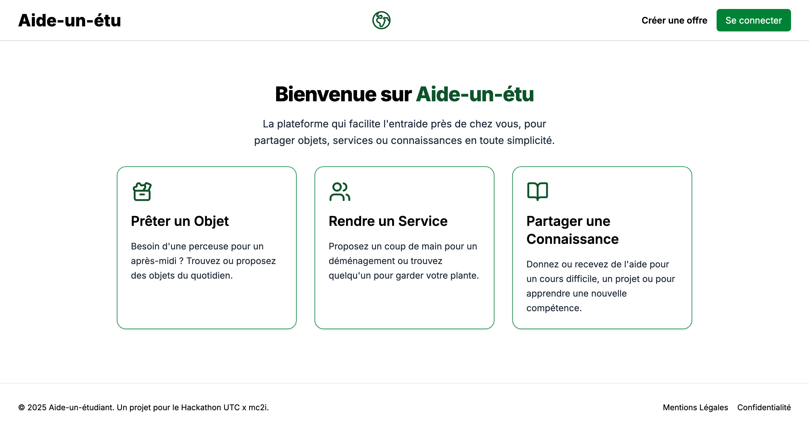
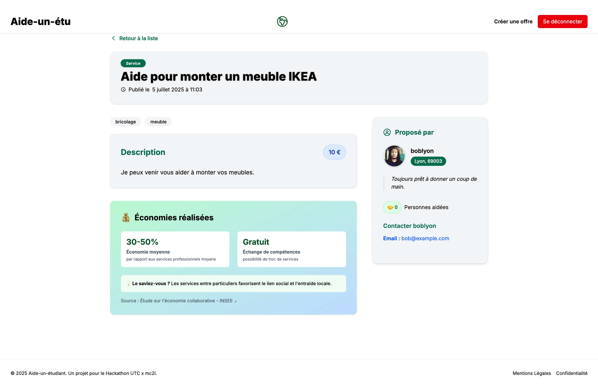
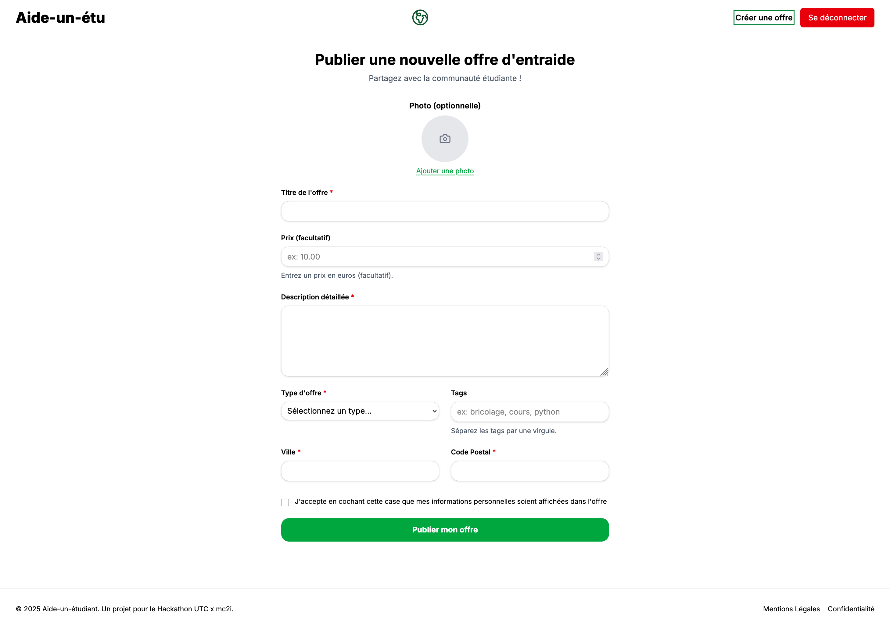

# Aide-un-étudiant

**Soumission pour le Hackathon UTC x mc2i — Numérique Responsable**

---

## Introduction & Vision du Projet

**Aide-un-étudiant** est une plateforme d’entraide locale dédiée aux étudiants, permettant le prêt d’objets, l’échange de services et le partage de connaissances. Notre mission : faciliter la solidarité étudiante tout en sensibilisant à l’économie du partage et à la réduction de la consommation.

Ce projet n’est pas qu’une simple application fonctionnelle. Il a été conçu de bout en bout selon les principes du **numérique responsable** : sobriété, performance, accessibilité et impact social positif.  
Un élément central de cette démarche est la fonctionnalité **Score d’Impact Positif**, qui valorise chaque action d’entraide et transforme la plateforme en véritable outil de sensibilisation à l’économie circulaire.

---

## Aperçu de l’Application

-   
  _[Screenshot de la page d’accueil]_

-   
  _[Screenshot de la page de détail d’une offre]_

-   
  _[Screenshot du formulaire de création d’offre]_

---

## Fonctionnalités Principales

- **Authentification sécurisée** via un provider OAuth étudiant (NextAuth.js)
- **Consultation des offres** par catégories : Objets, Services, Connaissances
- **Filtrage avancé** par nom, code postal et tags
- **Création d’offres** d’entraide avec formulaire accessible
- **Page de détail** pour chaque offre, avec contact du proposant
- **Page de profil** à compléter lors de la première connexion
- **Score d’Impact Positif** : chaque offre réalisée valorise l’économie du partage et l’impact environnemental
- **Suppression d’offres** par leur propriétaire
- **Expérience utilisateur** optimisée pour mobile et desktop

---

## Notre Engagement pour un Numérique Responsable

### Écoconception (Sobriété & Performance)

- **Architecture Server-First**  
  Utilisation intensive des **Server Components** et **Server Actions** de Next.js pour minimiser le JavaScript envoyé au client et réduire l’empreinte carbone numérique.

- **Data Fetching Efficace**  
  Les requêtes Prisma utilisent systématiquement `include` et `select` pour ne récupérer que les données strictement nécessaires.

- **Performance de Rendu**  
  Les pages de catégories bénéficient de `generateStaticParams` pour un rendu statique ultra-rapide et économe en ressources.

- **CSS Optimisé**  
  Le thème Tailwind CSS est centralisé, avec des classes utilitaires et l’usage de `@apply` pour unifier les styles et réduire le poids du CSS.

- **Feuille de Style d’Impression**  
  Une feuille de style `@media print` est prévue pour économiser encre et papier lors de l’impression des offres.

### Accessibilité (Inclusion)

- **Structure Sémantique**  
  Utilisation rigoureuse des balises HTML5 (`<main>`, `<nav>`, `<article>`, `<aside>`) pour une navigation claire et accessible.

- **Navigation au Clavier**  
  Tous les éléments interactifs sont accessibles au clavier, avec des indicateurs de focus visibles (`focus:ring`).

- **Formulaires Accessibles**  
  Les champs de formulaire sont associés à des `<label>`, et les erreurs sont gérées via des attributs ARIA (`aria-describedby`) pour les lecteurs d’écran.

- **Contrastes Élevés**  
  La palette de couleurs a été choisie pour garantir une excellente lisibilité, même en mode sombre.

---

## Stack Technique

- **Framework** : Next.js (App Router, Server Components)
- **Langage** : TypeScript
- **Styling** : Tailwind CSS
- **Base de Données** : PostgreSQL (Supabase en production) / SQLite (local)
- **ORM** : Prisma
- **Authentification** : NextAuth.js (Auth.js v5)

---

## Guide d’Installation & Lancement Local

### Prérequis

- Node.js (v18+ recommandé)
- npm ou pnpm

### Installation

```bash
# 1. Cloner le dépôt
git clone <URL_DU_DEPOT>
cd aide-un-etudiant

# 2. Installer les dépendances
npm install
# ou
pnpm install

# 3. Configurer l’environnement
cp .env.example .env
# Remplir les variables nécessaires :
# - DATABASE_URL (sqlite pour local, postgres pour prod)
# - MY_CLIENT_ID, MY_CLIENT_SECRET, OAUTH_AUTHORIZATION_URL, OAUTH_ACCESS_TOKEN_URL, OAUTH_RESOURCE_OWNER_DETAILS_URL, OAUTH_SCOPES

# 4. Initialiser la base de données locale
npx prisma db push

# 5. Lancer le serveur de développement
npm run dev